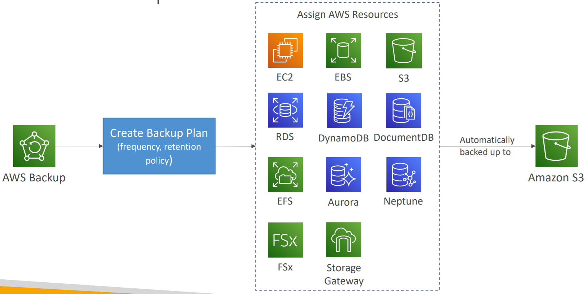

# AWS Backup

- Fully managed service
- Centrally manage and automate backups across AWS services
- No need to create custom scripts and manual processes

## Supported Services:
- Amazon EC2 / Amazon EBS
- Amazon S3
- Amazon RDS (all DB engines) / Amazon Aurora / Amazon DynamoDB
- Amazon DocumentDB / Amazon Neptune
- Amazon EFS / Amazon FSx (Lustre & Windows File Server)
- AWS Storage Gateway (Volume Gateway)

## Features:
- Supports **cross-region** backups
- Supports **cross-account** backups

---

## AWS Backup - Key Features

- Supports **PITR** (Point-In-Time Recovery) for supported services
- **On-Demand** and **Scheduled** backups
- **Tag-based backup policies**
- You create backup policies known as **Backup Plans**
- **Backup frequency:** (every 12 hours, daily, weekly, monthly, cron expression)
- **Backup window**
- **Transition to Cold Storage:** (Never, Days, Weeks, Months, Years)
- **Retention Period:** (Always, Days, Weeks, Months, Years)

---

## AWS Backup - Create Backup Plan

1. **Create Backup Plan** (define frequency, retention policy)
2. **Assign AWS Resources**:
    - EC2
    - EBS
    - RDS
    - DynamoDB
    - EFS
    - Aurora
    - FSx
    - Storage Gateway
    - Amazon S3 (automatically backed up to S3)
    - DocumentDB
    - Neptune

---

## AWS Backup Vault Lock

- Enforce a **WORM (Write Once Read Many)** state for all the backups that you store in your AWS Backup Vault.
- Additional layer of defense to protect your backups against:
  - Inadvertent or malicious delete operations
  - Updates that shorten or alter retention periods
- Even the **root user** cannot delete backups when enabled.
