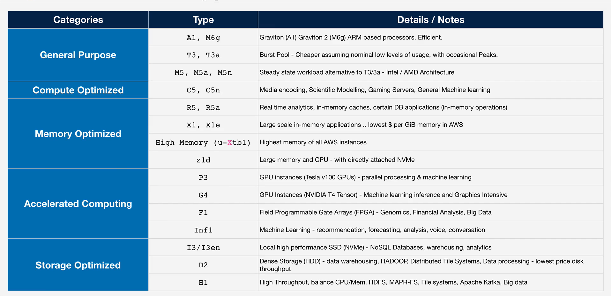
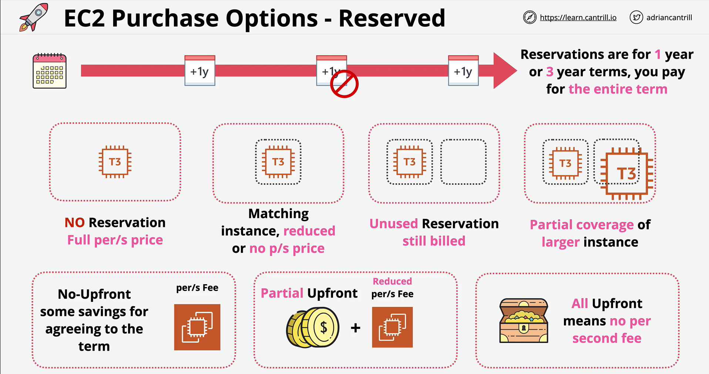
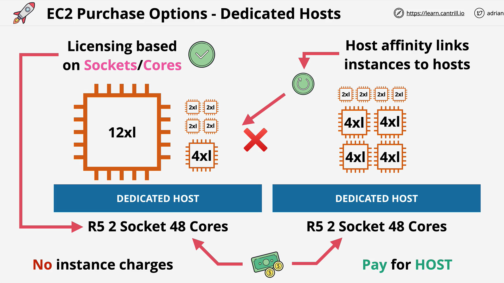
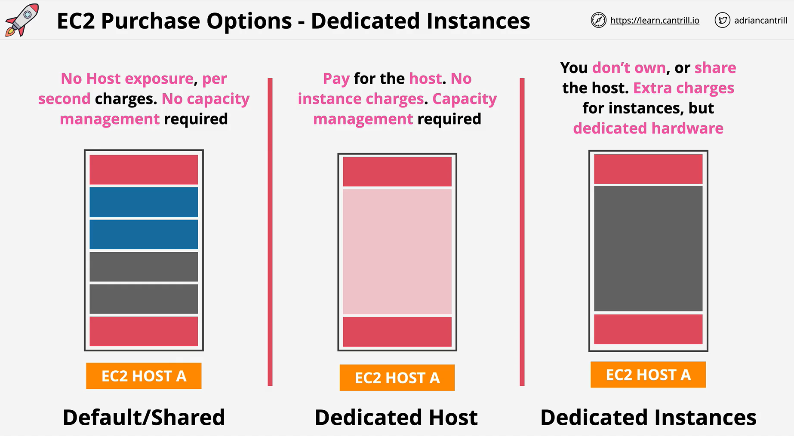
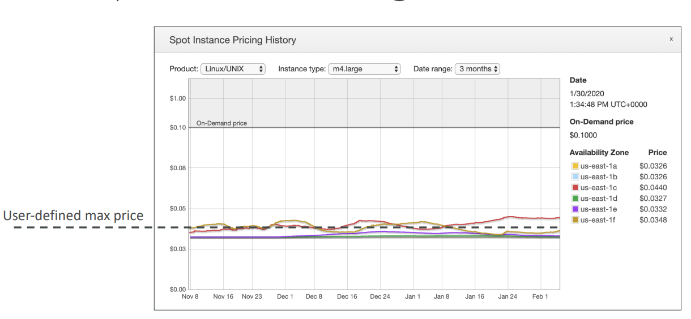
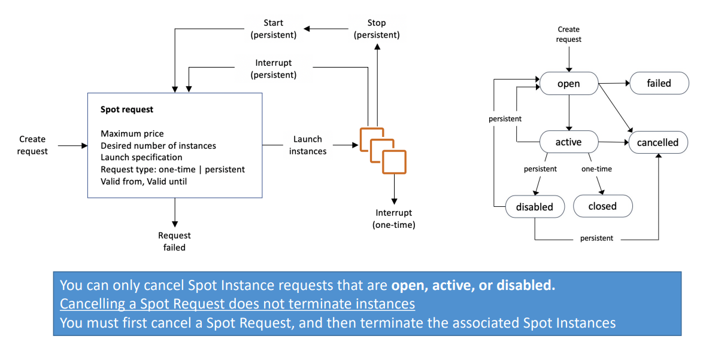
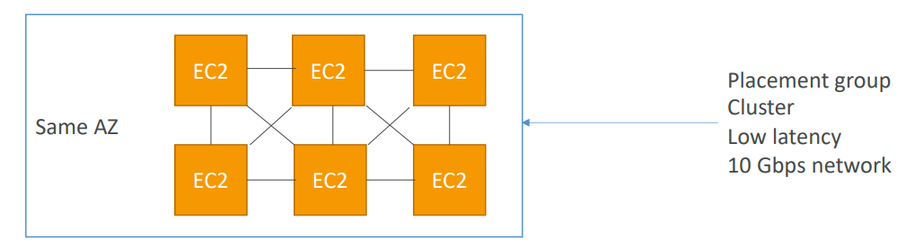
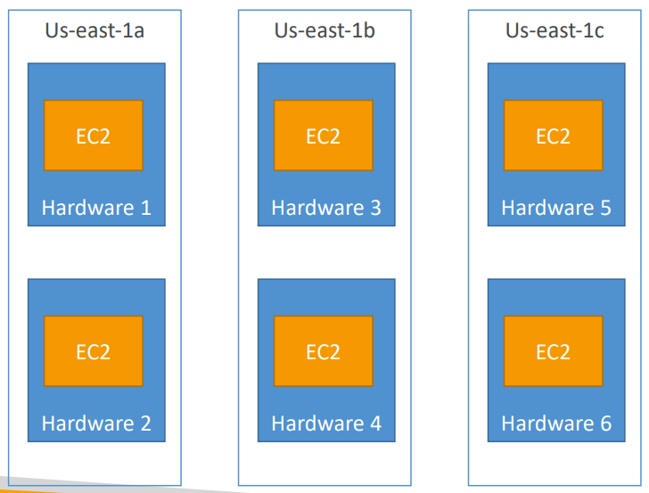
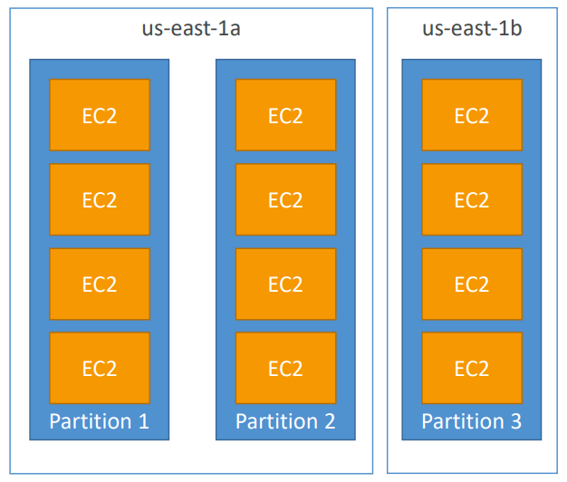

# EC2 Instance Types

You can use different types of EC2 instances that are optimized for different use cases ([AWS EC2 Instance Types](https://aws.amazon.com/ec2/instance-types/))  
AWS has the following naming convention:  
`m5.2xlarge`  
- **m:** instance class  
- **5:** generation (AWS improves them over time)  
- **2xlarge:** size within the instance class  
  

# General Purpose

| Instance Types                                                              |
| --------------------------------------------------------------------------- |
| M5, M5a, M5ad, M5d, M5dn, M5n, M5zn, M6a, M6g, M6gd, M6i, M6id, M6idn, M6in |
| --------------------------------------------------------------------------- |
| M7a, M7g, M7gd, M7i, M7i-flex, M8a, M8g, M8gb, M8gd, M8gn, M8i, M8i-flex    |
| --------------------------------------------------------------------------- |
| Mac1, Mac2, Mac2-m1ultra, Mac2-m2, Mac2-m2pro, Mac-m4, Mac-m4pro            |
| --------------------------------------------------------------------------- |
| T2, T3, T3a, T4g                                                            |

- **Provide a balance of compute, memory, and networking resources.**  
- These instances are ideal for applications that use these resources in equal proportions, such as web servers and code repositories.  
- The **T** instance family is also referred to as burstable performance instances. These instances provide a baseline CPU performance with the ability to burst above the baseline at any time. For more information, see [Burstable performance instances in the Amazon EC2 User Guide](https://docs.aws.amazon.com/AWSEC2/latest/UserGuide/burstable-performance-instances.html).

 

# Compute Optimized

| Instance Types                                                                   |
| -------------------------------------------------------------------------------- |
| C5, C5a, C5ad, C5d, C5n, C6a, C6g, C6gn, C6i, C6id, C6in, C7a, C7g, C7gd, C7gn   |
| -------------------------------------------------------------------------------- |
| C7i, C7i-flex, C8a, C8g, C8gb, C8gd, C8gn, C8i, C8i-flex                         |

- Designed for compute-intensive applications that benefit from high-performance processors.  
- These instances are ideal for batch processing workloads, media transcoding, high-performance web servers, high-performance computing (HPC), scientific modeling, dedicated gaming servers, ad server engines, and machine learning inference.  
  
 

# Memory Optimized

| Instance Types                                                           |
| ------------------------------------------------------------------------ |
| R5, R5a, R5ad, R5b, R5d, R5dn, R5n                                       |
| -----------------------------------------------------------------------  |
| R6a, R6g, R6gd, R6i, R6id, R6idn, R6in                                   |
| -----------------------------------------------------------------------  |
| R7a, R7g, R7gd, R7i, R7iz                                                |
| ------------------------------------------------------------------------ |
| R8a, R8g, R8gb, R8gd, R8gn, R8i, R8i-flex                                |
| ------------------------------------------------------------------------ |
| U-3tb1, U-6tb1, U-9tb1, U-12tb1, U-18tb1, U-24tb1                        |
| ------------------------------------------------------------------------ |
| U7i-6tb, U7i-8tb, U7i-12tb, U7in-16tb, U7in-24tb, U7in-32tb, U7inh-32tb  |
| ------------------------------------------------------------------------ |
| X1, X1e, X2gd, X2idn, X2iedn, X2iezn                                     |
| ------------------------------------------------------------------------ |
| X8g, X8aedz, z1d                                                         |
| ------------------------------------------------------------------------ |

- Designed to deliver fast performance for workloads that process large data sets in memory.  
 

# Storage Optimized

| Instance Types                |
| ----------------------------- |
| D2, D3, D3en, H1              |
| ----------------------------- |
| I3, I3en, I4g, I4i, I7i, I7ie |
| ----------------------------- |
| I8g, I8ge, Im4gn, Is4gen      |
| ----------------------------- |

- Designed for workloads that require high, sequential read and write access to very large data sets on local storage.  
- They are optimized to deliver tens of thousands of low-latency, random I/O operations per second (IOPS) to applications.  
 

## Accelerated Computing

| Instance Types                             |
| ------------------------------------------ |
| DL1, DL2q, F1, F2                          |
| ------------------------------------------ |
| G4ad, G4dn, G5, G5g, G6, G6e, G6f          |
| ------------------------------------------ |
| Gr6, Gr6f, Inf1, Inf2, P4d, P4de           |
| ------------------------------------------ |
| P5, P5e, P5en, P6-B200, P6-B300, P6e-GB200 |
| ------------------------------------------ |
| Trn1, Trn1n, Trn2, Trn2u, VT1              |

- Use hardware accelerators, or co-processors, to perform functions, such as floating-point number calculations, graphics processing, or data pattern matching, more efficiently than is possible in software running on CPUs.  
 

# High-Performance Computing

| Instance Types              |
| --------------------------- |
| Hpc6a, Hpc6id, Hpc7a, Hpc7g |

- Purpose-built to offer the best price performance for running HPC workloads at scale on AWS.  
- These instances are ideal for applications that benefit from high-performance processors, such as large, complex simulations and deep learning workloads.  
 
----------------------------------------------------------------------------------------------------
  

# EC2 Instances Purchasing Options

- **On-Demand Instances** – short workload, predictable pricing, pay by second  
- **Reserved (1 & 3 years)**
  - **Reserved Instances** – long workloads  
  - **Convertible Reserved Instances** – long workloads with flexible instances  
- **Savings Plans (1 & 3 years)** – commitment to an amount of usage, long workload  
- **Spot Instances** – short workloads, cheap, can lose instances (less reliable)  
- **Dedicated Hosts** – book an entire physical server, control instance placement  
- **Dedicated Instances** – no other customers will share your hardware  
- **Capacity Reservations** – reserve capacity in a specific AZ for any duration

 

---

## EC2 On Demand

- Pay for what you use:
  - Linux or Windows - billing per second, after the first minute
  - All other operating systems - billing per hour
- Has the highest cost but no upfront payment
- No long-term commitment
- Recommended for short-term and uninterrupted workloads, where you can't predict how the application will behave

 

---

## EC2 Reserved Instances

- Up to 72% discount compared to On-demand
- You reserve a specific instance attributes (Instance Type, Region, Tenancy, OS)
- **Reservation Period** – 1 year (+discount) or 3 years (+++discount)
- **Payment Options** – No Upfront (+), Partial Upfront (++), All Upfront (+++)
- Reserved Instance’s Scope – Regional or Zonal (reserve capacity in an AZ)
- Recommended for steady-state usage applications (think database)
- You can buy and sell in the Reserved Instance Marketplace

 

---
### Convertible Reserved Instance

- Can change the EC2 instance type, instance family, OS, scope, and tenancy
- Up to 66% discount  
> Note: The % discounts are different over time – the exact numbers are not needed for the exam. This is just for illustrative purposes.

 

---

## EC2 Savings Plans

- Get a discount based on long-term usage (up to 72% - same as RIs)
- Commit to a certain type of usage ($10/hour for 1 or 3 years)
- Usage beyond EC2 Savings Plans is billed at the On-Demand price
- Locked to a specific instance family & AWS region (e.g., M5 in us-east-1)
- **Flexible across:**
  - Instance Size (e.g., m5.xlarge, m5.2xlarge)
  - OS (e.g., Linux, Windows)
  - Tenancy (Host, Dedicated, Default)

 

---

## EC2 Spot Instances

- Can get a discount of up to 90% compared to On-demand
- Instances that you can “lose” at any point of time if your max price is less than the current spot price
- The MOST cost-efficient instances in AWS
- Useful for workloads that are resilient to failure:
  - Batch jobs
  - Data analysis
  - Image processing
  - Any distributed workloads
  - Workloads with a flexible start and end time
- Not suitable for critical jobs or databases

 

---

## EC2 Dedicated Hosts

- A physical server with EC2 instance capacity fully dedicated to your use
- Allows you to address compliance requirements and use your existing server-bound software licenses (per-socket, per-core, per-VM software licenses)
- **Purchasing Options:**
  - On-demand – pay per second for active Dedicated Host
  - Reserved - 1 or 3 years (No Upfront, Partial Upfront, All Upfront)
- The most expensive option
- Useful for software that has complicated licensing models (BYOL – Bring Your Own License) or for companies with strong regulatory or compliance needs

 

---

## EC2 Dedicated Instances

- Instances run on hardware that’s dedicated to you
- May share hardware with other instances in the same account
- No control over instance placement (can move hardware after Stop / Start)

 

---

## EC2 Capacity Reservations

- Reserve On-Demand instances capacity in a specific AZ for any duration
- You always have access to EC2 capacity when you need it
- No time commitment (create/cancel anytime), no billing discounts
- Combine with Regional Reserved Instances and Savings Plans to benefit from billing discounts
- You’re charged at On-Demand rate whether you run instances or not
- Suitable for short-term, uninterrupted workloads that need to be in a specific AZ

 

---

## Which purchasing option is right for me?

- **On demand**: coming and staying in resort whenever we like, we pay the full price
- **Reserved**: like planning ahead and if we plan to stay for a long time, we may get a good discount.
- **Savings Plans**: pay a certain amount per hour for a certain period and stay in any room type (e.g., King, Suite, Sea View)
- **Spot instances**: the hotel allows people to bid for the empty rooms and the highest bidder keeps the rooms. You can get kicked out at any time
- **Dedicated Hosts**: We book an entire building of the resort
- **Capacity Reservations**: you book a room for a period with full price even if you don’t stay in it

 

---

## Price Comparison

**Example – m4.large – us-east-1**

| Price Type                             | Price (per hour)                           |
| -------------------------------------- | ------------------------------------------ |
| On-Demand                              | $0.10                                      |
| Spot Instance (Spot Price)             | $0.038 - $0.039 (up to 61% off)            |
| Reserved Instance (1 year)             | $0.062 (No Upfront) - $0.058 (All Upfront) |
| Reserved Instance (3 years)            | $0.043 (No Upfront) - $0.037 (All Upfront) |
| EC2 Savings Plan (1 year)              | $0.062 (No Upfront) - $0.058 (All Upfront) |
| Reserved Convertible Instance (1 year) | $0.071 (No Upfront) - $0.066 (All Upfront) |
| Dedicated Host On-Demand Price         | [Varies by instance]                       |
| Dedicated Host Reservation             | Up to 70% off                              |
| Capacity Reservations                  | On-Demand Price                            |

 

---

## EC2 Spot Instance Requests

- Can get a discount of up to 90% compared to On-demand
- Define max spot price and get the instance while current spot price < max
- The hourly spot price varies based on offer and capacity
- If the current spot price > your max price, you can choose to stop or terminate your instance with a 2-minute grace period.

- Used for batch jobs, data analysis, or workloads that are resilient to failures.
- Not great for critical jobs or databases

 

---

## EC2 Spot Instances Pricing

[EC2 Spot Instance Pricing](https://console.aws.amazon.com/ec2sp/v1/spot/home?region=us-east-1#)

 

---

## How to terminate Spot Instances?

[Spot Instance Termination Guide](https://docs.aws.amazon.com/AWSEC2/latest/UserGuide/spot-requests.html)

- You can only cancel Spot Instance requests that are open, active, or disabled.
- Cancelling a Spot Request does not terminate instances.
- You must first cancel a Spot Request, and then terminate the associated Spot Instances.

 

---

## Spot Fleets

- **Spot Fleets** = set of Spot Instances + (optional) On-Demand Instances
- The Spot Fleet will try to meet the target capacity with price constraints
- Define possible launch pools: instance type (m5.large), OS, Availability Zone
- Can have multiple launch pools, so that the fleet can choose
- Spot Fleet stops launching instances when reaching capacity or max cost
- Strategies to allocate Spot Instances:
  - **lowestPrice**: from the pool with the lowest price (cost optimization, short workload)
  - **diversified**: distributed across all pools (great for availability, long workloads)
  - **capacityOptimized**: pool with the optimal capacity for the number of instances
  - **priceCapacityOptimized** (recommended): pools with the highest capacity available, then select the pool with the lowest price (best choice for most workloads)
- Spot Fleets allow us to automatically request Spot Instances with the lowest price

 

---
-------------------------------------------------------------------------------------------
  

# Placement Groups

- Sometimes you want control over the EC2 Instance placement strategy.
- That strategy can be defined using **placement groups**.
- When you create a placement group, you specify one of the following strategies for the group:

- **Cluster**—clusters instances into a low-latency group in a single Availability Zone.
- **Spread**—spreads instances across underlying hardware (max 7 instances per group per AZ).
- **Partition**—spreads instances across many different partitions (which rely on different sets of racks) within an AZ. Scales to 100s of EC2 instances per group (Hadoop, Cassandra, Kafka).

---
 

## Cluster Placement Group

| Pros                                                                                                 | Cons                                                    |
| ---------------------------------------------------------------------------------------------------- | ------------------------------------------------------- |
| - Great network (10 Gbps bandwidth between instances with Enhanced Networking enabled - recommended) | - If the AZ fails, all instances fail at the same time. |

**Use case:**
- Big Data job that needs to complete fast
- Application that needs extremely low latency and high network throughput

---

## Placement Groups Spread

| Pros                                               | Cons                                                |
| -------------------------------------------------- | --------------------------------------------------- |
| - Can span across Availability Zones (AZ)          | - Limited to 7 instances per AZ per placement group |
| - Reduced risk of simultaneous failure             |                                                     |
| - EC2 Instances are on different physical hardware |

**Use case:**

* Application that needs to maximize high availability
* Critical applications where each instance must be isolated from failure from each other

---

## Placements Groups Partition

* Up to 7 partitions per AZ.
* Can span across multiple AZs in the same region.
* Up to 100s of EC2 instances.
* The instances in a partition do not share racks with the instances in the other partitions.
* A partition failure can affect many EC2 instances but won’t affect other partitions.
* EC2 instances get access to the partition information as metadata.

**Use cases:** HDFS, HBase, Cassandra, Kafka.
