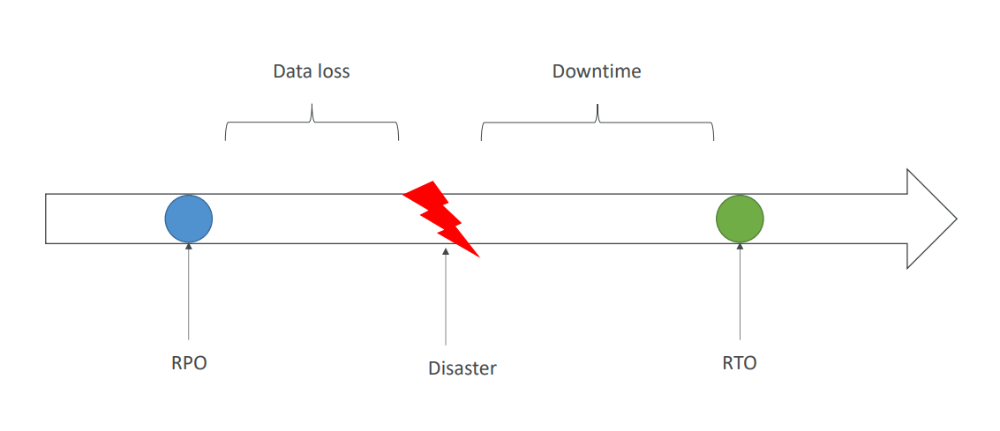
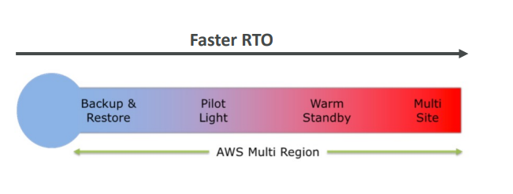
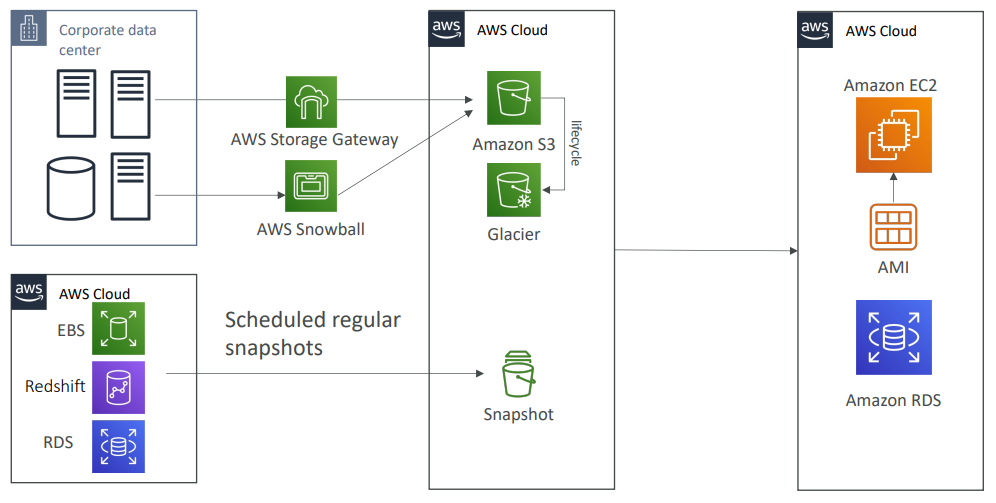
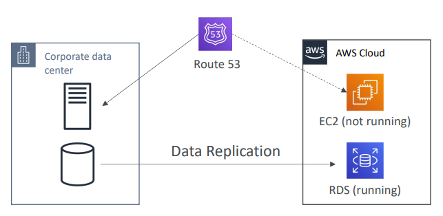
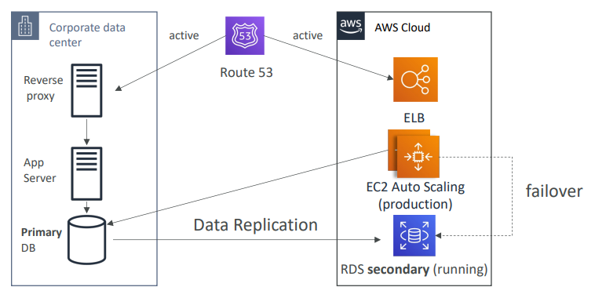
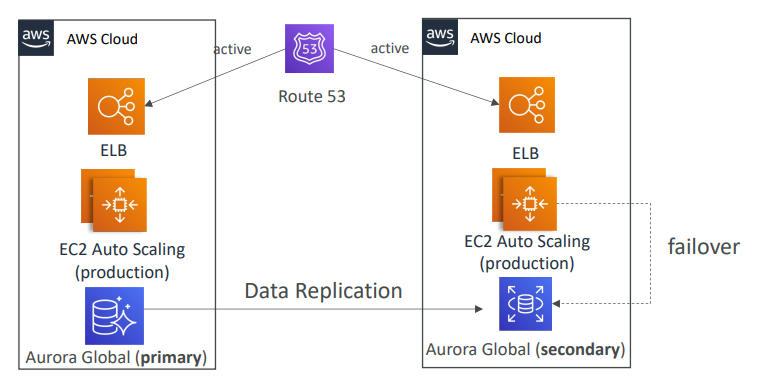

# Disaster Recovery Overview

- **Disaster**: Any event that has a negative impact on a company’s business continuity or finances is a disaster.
- **Disaster Recovery (DR)**: DR is about preparing for and recovering from a disaster.

### What kind of disaster recovery?
- **On-premise → On-premise**: Traditional DR, very expensive
- **On-premise → AWS Cloud**: Hybrid recovery
- **AWS Cloud Region A → AWS Cloud Region B**

### Key Terms:
- **RPO (Recovery Point Objective)**: Defines the acceptable amount of data loss during a disaster.
- **RTO (Recovery Time Objective)**: Defines the acceptable amount of downtime during a disaster.

---

## RPO and RTO

- **RPO (Disaster Data loss)**
- **RTO (Downtime)**

---

## Disaster Recovery Strategies

1. **Backup and Restore**
2. **Pilot Light**
3. **Warm Standby**
4. **Hot Site / Multi-Site Approach** (Faster RTO)

---

### Backup and Restore (High RPO)

- **Process**: Corporate data center → AWS Cloud
  - AWS Storage Gateway → Glacier → Amazon S3
  - AWS Snowball → EBS Snapshot → Redshift → RDS lifecycle
  - Regular scheduled snapshots (Amazon EC2, RDS AMI)

---

### Disaster Recovery – Pilot Light

- A small version of the app is always running in the cloud.
- Useful for the **critical core** (pilot light).
- Similar to **Backup and Restore**, but faster, as critical systems are already running.
  
**Architecture:**
- Corporate data center → AWS Cloud
  - RDS (running) → Data Replication
  - EC2 (not running)
  - Route 53

---

### Warm Standby

- Full system is up and running but at a minimum size.
- Upon disaster, we can scale to production load.

**Architecture:**
- Corporate data center → AWS Cloud
  - RDS Secondary (running) → Data Replication
  - Route 53 → ELB → EC2 Auto Scaling (minimum)
  - Reverse Proxy → App Server → Primary DB failover

---

### Multi-Site / Hot Site Approach

- **Very low RTO** (minutes or seconds) – very expensive.
- Full production scale is running on both AWS and On-Premise.

**Architecture:**
- Corporate data center → AWS Cloud
  - RDS Secondary (running) → Data Replication
  - Route 53 → ELB → EC2 Auto Scaling (production)
  - Reverse Proxy → App Server → Primary DB failover (active-active)

---

### All AWS Multi Region

- AWS Cloud (Data Replication)
- Route 53 → ELB → EC2 Auto Scaling (production)
  - Failover (active-active)
- AWS Cloud
  - EC2 Auto Scaling (production)
  - ELB → Aurora Global (Primary) → Aurora Global (Secondary)

---

## Disaster Recovery Tips

**Backup**:
- EBS Snapshots, RDS automated backups / Snapshots, etc.
- Regular pushes to S3 / S3 IA / Glacier, Lifecycle Policy, Cross Region Replication.
- From On-Premise: Snowball or Storage Gateway.

**High Availability**:
- Use Route53 to migrate DNS from Region to Region.
- RDS Multi-AZ, ElastiCache Multi-AZ, EFS, S3.
- Site-to-Site VPN as a recovery option for Direct Connect.

**Replication**:
- RDS Replication (Cross Region), AWS Aurora + Global Databases.
- Database replication from on-premises to RDS.
- Storage Gateway.

**Automation**:
- CloudFormation / Elastic Beanstalk to recreate a new environment.
- Recover / Reboot EC2 instances with CloudWatch alarms.
- AWS Lambda functions for customized automation.

**Chaos**:
- Netflix has a “simian-army” that randomly terminates EC2 instances.
