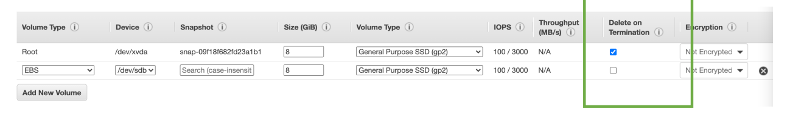
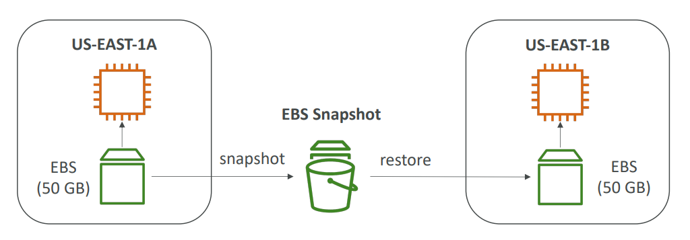
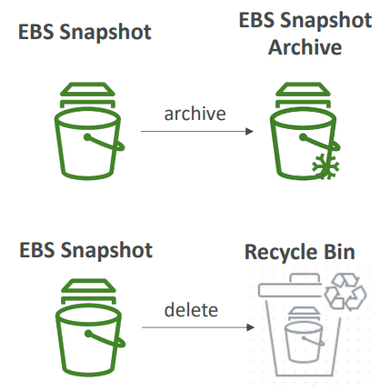
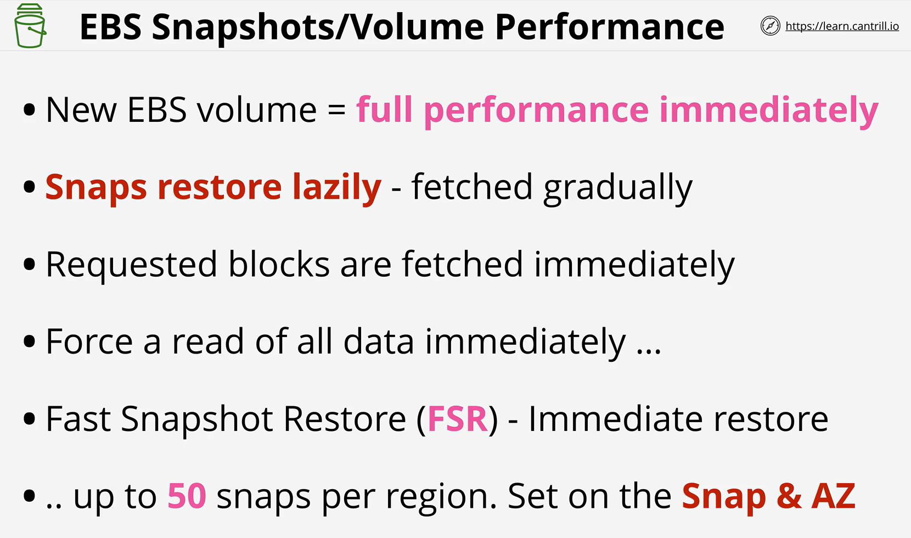
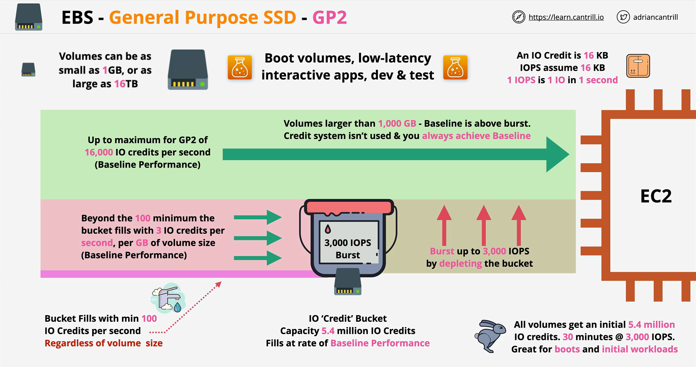
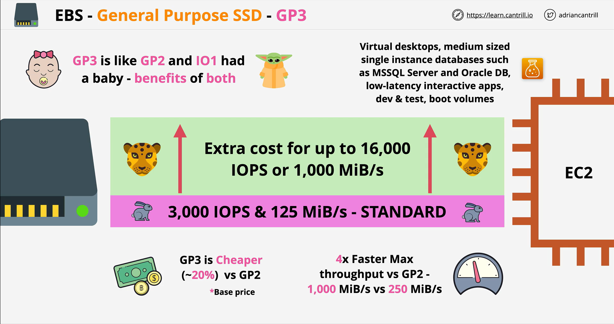
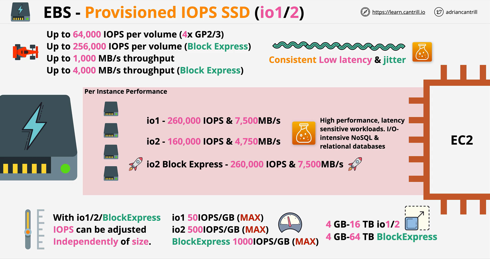
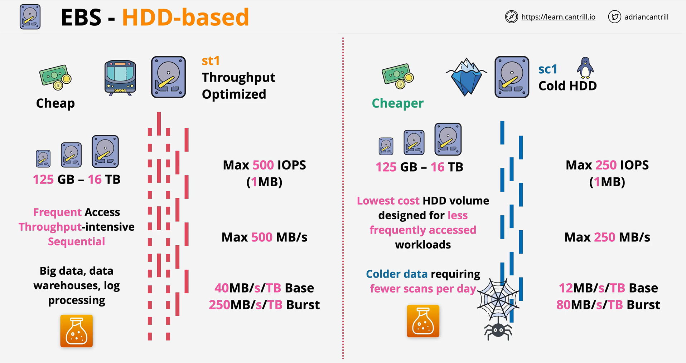
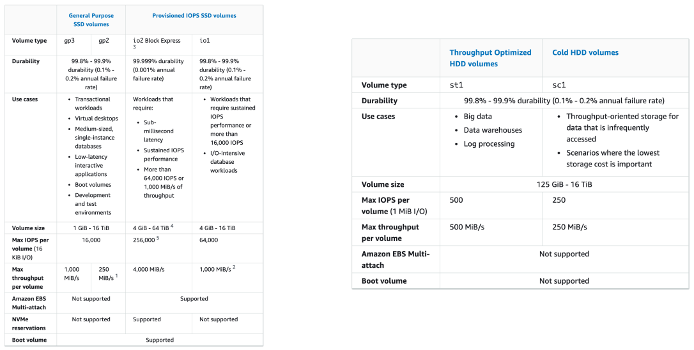
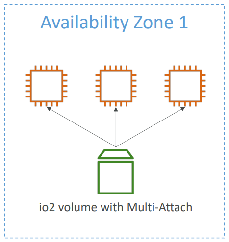

# EBS Volume

- An **EBS (Elastic Block Store) Volume** is a network drive you can attach to your instances while they run.
- It allows your instances to persist data, even after their termination.
- **They can only be mounted to one instance at a time**.
- They are bound to **a specific availability zone**.
- **Analogy**: Think of them as a “network USB stick”.

---

## EBS Volume Details

- It’s a network drive (i.e., not a physical drive).
- It uses the network to communicate with the instance, which means there might be a bit of latency.
- It can be detached from an EC2 instance and attached to another one quickly.
- It’s locked to an Availability Zone (AZ).
  - An EBS Volume in `us-east-1a` cannot be attached to `us-east-1b`.
- To move a volume across, you first need to snapshot it.
- Have a provisioned capacity (size in GBs, and IOPS).
- You get billed for all the provisioned capacity.
- You can increase the capacity of the drive over time.

---

## EBS – Delete on Termination Attribute

- **Controls the EBS behavior when an EC2 instance terminates**:
  - By default, the root EBS volume is deleted (attribute enabled).
  - By default, any other attached EBS volume is not deleted (attribute disabled).
- This can be controlled by the AWS console or AWS CLI.
- **Use case**: Preserve the root volume when an instance is terminated.

---

## EBS Snapshots

- Make a backup (snapshot) of your EBS volume at a point in time.
- It’s not necessary to detach the volume to do a snapshot, but it’s recommended.
- Snapshots can be copied across AZs or Regions.

---

## EBS Snapshots Features

- **EBS Snapshot Archive**:
  - Move a Snapshot to an “archive tier” that is 75% cheaper.
  - Restores take 24 to 72 hours.
- **Recycle Bin for EBS Snapshots**:
  - Setup rules to retain deleted snapshots so you can recover them after accidental deletion.
  - Specify retention (from 1 day to 1 year).
- **Fast Snapshot Restore (FSR)**:
  - Force full initialization of the snapshot to have no latency on the first use (extra cost).

---

## EBS Volume Types

EBS Volumes come in 6 types:

| Volume Type                       | Description                                                                                   |
| --------------------------------- | --------------------------------------------------------------------------------------------- |
| **gp2 / gp3 (SSD)**               | General-purpose SSD volume balancing price and performance                                    |
| **io1 / io2 Block Express (SSD)** | Highest-performance SSD volume for mission-critical, low-latency or high-throughput workloads |
| **st1 (HDD)**                     | Low-cost HDD volume for frequently accessed, throughput-intensive workloads                   |
| **sc1 (HDD)**                     | Lowest-cost HDD volume for less frequently accessed workloads                                 |

- EBS volumes are characterized by Size | Throughput | IOPS (I/O operations per second).
- When in doubt, always consult the AWS documentation.
- Only **gp2/gp3** and **io1/io2 Block Express** can be used as boot volumes.

---

## EBS Volume Types - Use Cases

### **General Purpose SSD (gp2 / gp3)**

- Cost-effective storage with low-latency.
- Use cases:
  - System boot volumes, virtual desktops, development, and test environments.
  - gp3:
    - Baseline of 3,000 IOPS and throughput of 125 MiB/s.
    - Can increase IOPS up to 16,000 and throughput up to 1000 MiB/s independently.
  - gp2:
    - Small volumes can burst IOPS to 3,000.
    - IOPS is tied to the size of the volume (max IOPS is 16,000).

### **Provisioned IOPS (PIOPS) SSD (io1 / io2 Block Express)**

- Critical business applications with sustained IOPS performance.
- Great for database workloads (sensitive to storage performance and consistency).
  - **io1** (4 GiB - 16 TiB):
    - Max IOPS: 64,000 for Nitro EC2 instances & 32,000 for other instances.
    - Can increase IOPS independently from storage size.
  - **io2 Block Express** (4 GiB - 64 TiB):
    - Sub-millisecond latency.
    - Max IOPS: 256,000 with an IOPS:GiB ratio of 1,000:1.
    - Supports **EBS Multi-Attach**.

### **Hard Disk Drives (HDD) – st1 / sc1**

- Cannot be a boot volume.
  - **st1**:
    - For Big Data, Data Warehouses, Log Processing.
    - Max throughput 500 MiB/s, max IOPS 500.
  - **sc1**:
    - For data that is infrequently accessed.
    - Suitable for scenarios where the lowest cost is important.
    - Max throughput 250 MiB/s, max IOPS 250.

---

## EBS Volume Types - Summary

For more information on EBS volume types, consult [AWS Documentation](https://docs.aws.amazon.com/AWSEC2/latest/UserGuide/ebs-volume-types.html#solid-state-drives).

---

## EBS Multi-Attach – io1/io2 family

- Attach the same EBS volume to multiple EC2 instances in the same AZ.
- Each instance has full read and write permissions to the high-performance volume.
- **Use case**:
  - Achieve higher application availability in clustered Linux applications (e.g., Teradata).
  - Applications must manage concurrent write operations.
  - Up to 16 EC2 instances at a time.
  - Must use a file system that’s cluster-aware (not XFS, EXT4, etc.).

---

## EBS Encryption

- When you create an encrypted EBS volume, the following happens:
  - Data at rest is encrypted inside the volume.
  - All data in flight moving between the instance and the volume is encrypted.
  - All snapshots are encrypted.
  - All volumes created from the snapshot are encrypted.
- Encryption is handled transparently (no manual work needed).
- Minimal impact on latency.
- **EBS Encryption** uses keys from **KMS (AES-256)**.
- Copying an unencrypted snapshot allows encryption.
- Snapshots of encrypted volumes are encrypted.

---

## Encryption: Encrypt an Unencrypted EBS Volume

1. Create an EBS snapshot of the volume.
2. Encrypt the EBS snapshot (using copy).
3. Create a new EBS volume from the snapshot (the volume will be encrypted).
4. Attach the encrypted volume to the original instance.

---

