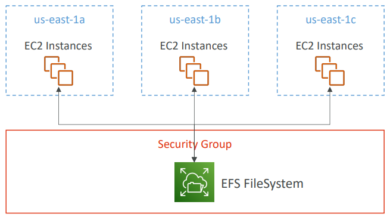
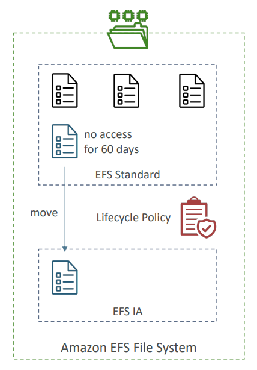
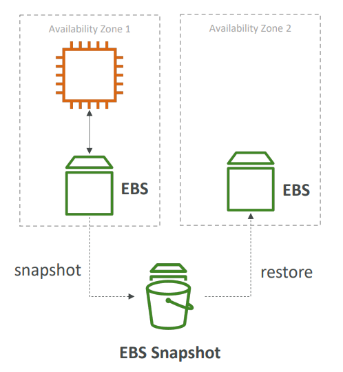

## Amazon EFS – Elastic File System

- Managed **NFS (Network File System)** that can be mounted on many EC2 instances.
- EFS works with EC2 instances in multi-AZ.
- Highly available, scalable, and pay-per-use (expensive, 3x the price of gp2).

**Use cases**: Content management, web serving, data sharing, WordPress.

- **EFS Features**:
  - Uses **NFSv4.1** protocol.
  - Uses **Security Group** to control access.
  - Compatible with **Linux-based AMI** (not Windows).
  - **Encryption at rest** using **KMS**.
  - **POSIX file system** (~Linux), supports standard file APIs.
  - **Scales automatically**, no capacity planning!

---

## EFS – Performance & Storage Classes

- **EFS Scale**:
  - 1000s of concurrent NFS clients, 10 GB+ throughput.
  - Scales to Petabyte-scale automatically.
  
- **Performance Mode**:
  - **General Purpose** (default) – low latency for web servers, CMS, etc.
  - **Max I/O** – higher latency, higher throughput, suitable for big data and media processing.

- **Throughput Mode**:
  - **Bursting** – 1 TB = 50 MiB/s + burst of up to 100 MiB/s.
  - **Provisioned** – set throughput independently of storage size (e.g., 1 GiB/s for 1 TB storage).
  - **Elastic** – automatically scales throughput based on workload.

- **Storage Tiers**:
- 
  
  - **Standard**: For frequently accessed files.
  - **Infrequent Access (EFS-IA)**: Lower price for less frequently accessed data.
  - **Archive**: Rarely accessed data, 50% cheaper.

---

## EBS vs EFS – Elastic Block Storage

# EBS vs EFS

| Feature                    | **EBS Volumes**                                            | **EFS**                                                    |
| -------------------------- | ---------------------------------------------------------- | ---------------------------------------------------------- |
| **Instance Attachment**    | One instance (except multi-attach io1/io2)                 | Mounting 100s of instances across AZs                      |
| **Availability Zone Lock** | Locked to an Availability Zone (AZ)                        | Scalable across multiple Availability Zones (AZs)          |
| **Migration Between AZs**  | 1. Take a snapshot. 2. Restore the snapshot to another AZ. | No migration needed, automatically available across AZs    |
| **Use Case**               | For single-instance applications                           | Suitable for shared file systems across multiple instances |
| **Cost**                   | Generally cheaper, but limited to one AZ                   | More expensive than EBS, but offers scalability            |

